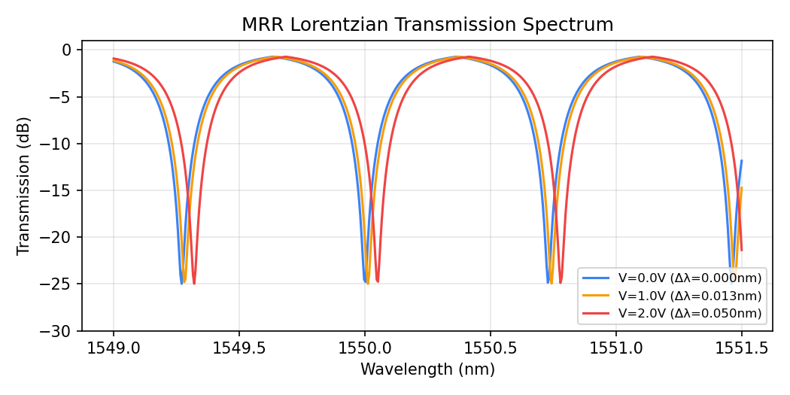
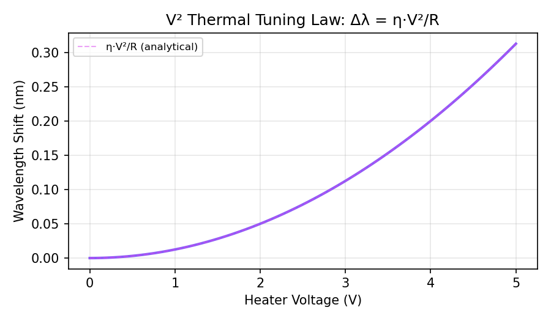
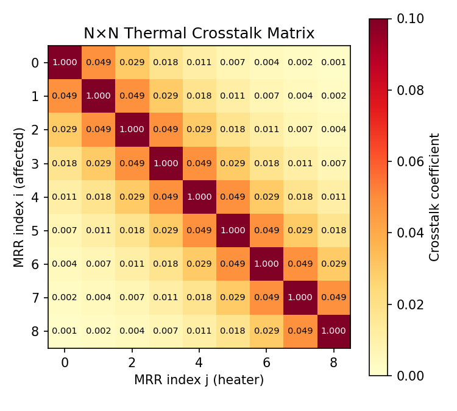
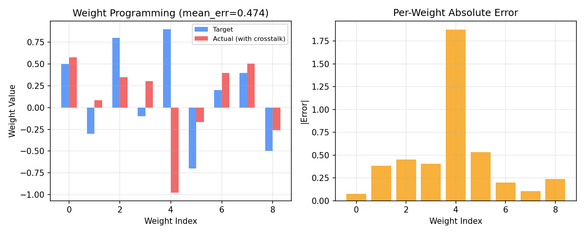
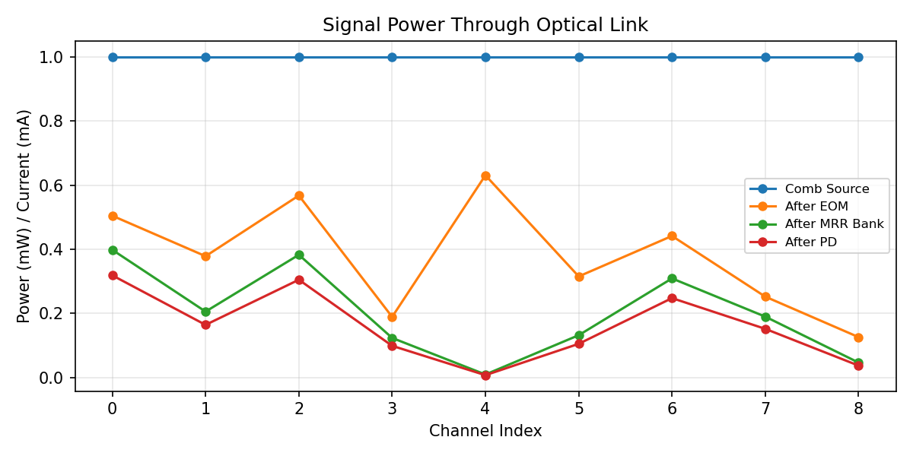

# photonic-sim: 研究级 WDM MRR 仿真平台

`photonic-sim` 是一个独立的底层光子仿真组件库，旨在为光子计算芯片（如基于微梳和微环谐振器阵列的 Optical Neural Networks）的权重编程、热漂移校准和 AI 控制策略验证提供物理准确的、可扩展的仿真环境。

本项目通过严谨的物理公式实现器件建模，采用组件化（Component-based）设计，支持通过将光信号（Optical Signal）在不同光学组件（MRR、调制器、探测器等）间传递来搭建端到端的复杂光链路。

## 环境要求与安装

### 运行环境
- Python >= 3.8
- 核心依赖：`numpy>=1.20`, `scipy>=1.7`
- 画图依赖（可选，用于生成测试及汇报图表）：`matplotlib`

### 安装
克隆代码库并在当前环境内以可编辑模式安装：
```bash
git clone <repository_url>
cd photonic-sim
pip install -e .
```

## 基本组件架构

`photonic-sim` 主要分为三个核心层级：

1. **`core/` 物理基础层**：
   - 定义材料属性和光学器件物理常量。
   - 实现底层的微环谐振器（MRR）器件物理（Lorentzian 近似，$V^2$ 热光调谐，最近邻/全局衰减热串扰）。
2. **`components/` 器件抽象层**：
   - 定义光学组件抽象基类 `OpticalComponent` 与统一的光信号接口 `OpticalSignal`。
   - 包括电光调制器（EOM）、光电探测器（PD）、MRR权重滤波器（MRRBankFilter）和光纤（FiberSpan）。
3. **`link/` 链路编排层**：
   - 提供 `OpticalLink` 用于任意光学组件的前向串联。

## 如何使用 (Quick Start)

以下展示如何使用本仿真平台搭建一个 **EOM调制 → MRR权重调整 → PD探测** 的基本光链路：

```python
import numpy as np
from photonic_sim.core import WavelengthGrid, MRRWeightBank
from photonic_sim.components import create_comb_signal, EOMModulator, MRRBankFilter, Photodetector
from photonic_sim.link import OpticalLink

# 1. 初始化物理系统
# 生成包含 9 个波长的微梳光源 (FSR=0.73nm)
grid = WavelengthGrid(center_nm=1550.0, fsr_nm=0.73, num_lines=9)
# 创建 9 通道 MRR 阵列并编程目标权重
target_weights = np.array([0.5, -0.3, 0.8, -0.1, 0.9, -0.7, 0.2, 0.4, -0.5])
bank = MRRWeightBank(num_weights=9, comb_wavelengths_nm=grid.wavelengths)
bank.program_weights(target_weights)

# 2. 搭建端到端光链路
link = OpticalLink([
    EOMModulator(insertion_loss_db=1.0),            # EOM 调制器，损耗 1dB
    MRRBankFilter(bank),                            # MRR 滤波器阵列
    Photodetector(responsivity=0.8, adc_bits=10),   # 探测器（含散粒噪声和 10-bit 量化）
])

# 3. 生成输入光信号并携带数据
# 生成均一功率为 1.0mW 的各通道梳齿信号
signal = create_comb_signal(grid, power_per_line_mw=1.0, num_channels=9)
# EOM 输入电数据
signal.data = np.array([0.8, 0.6, 0.9, 0.3, 1.0, 0.5, 0.7, 0.4, 0.2])

# 4. 执行前向仿真
output_signal = link.forward(signal)

print("输出各通道探测光电流 (mA):")
print(output_signal.powers)
```

## 物理公式与器件模型

本项目的所有组件均基于工业界与学术界的严谨物理公式进行建模。

### 1. Lorentzian 透射谱 (Lorentzian Transmission Spectrum)
光信号经过 MRR 的透射率受 Lorentzian 分布控制（Notch Filter）。透射率 $T(\lambda)$ 依赖于波长失谐 $\delta$ 和半高半宽 $\gamma$：

```math
T(\delta) = 1 - \frac{1 - T_{min}}{1 + (\delta / \gamma)^2}
```

*其中，$\delta = (\lambda - \lambda_{res} + FSR/2) \mod FSR - FSR/2$ 实现周期折叠。*



### 2. V² 热光调谐 (V² Thermal Tuning Law)
与简化版仿真不同，真实的微环热源为微电阻，在欧姆加热的物理规律下，其产生的波长偏移与电压平方成正比。

```math
P = \frac{V^2}{R_{heater}} \\
\Delta\lambda = \eta \cdot P 
```



### 3. $N \times N$ 全局热串扰矩阵 (Thermal Crosstalk Matrix)
在 MRR Bank 中，相邻器件相互影响的串扰随物理距离呈指数衰减。此仿真使用了完整的 $N \times N$ 全局干扰矩阵计算真实影响。

```math
C_{i,j} = \begin{cases} 
1.0 & i=j \\ 
\alpha \cdot e^{-\frac{|i-j|}{L}} & i \neq j 
\end{cases}
```

*实际波长偏移向量为* $\Delta\mathbf{\lambda}_{total} = C \times \Delta\mathbf{\lambda}_{ideal}$。



### 4. 权重编程仿真结果 (Weight Programming)
由于存在强烈的热串扰和底层随机漂移（drifting noise），施加的物理操作（电压）必然带来额外的静态误差。下图展示了闭环目标权重与包含系统性误差在内的实际底层权重对比分布。


### 5. 端到端光链路功率流 (End-to-End Link Power Flow)
当组件如珠串链起来执行时，每到一个组件光信号的功率便会受到调制、衰减或吸收，最后在探测器转换为光电流并呈现离散量化阶级。


## 参考工作与文献对照

仿真底层建模直接对标前沿研究：

1. **Bai et al.**, "Microcomb-based integrated photonic processing unit", *Nature Communications*, 2023. DOI: [10.1038/s41467-022-35506-9](https://doi.org/10.1038/s41467-022-35506-9)
   *(为本项目的 WavelengthGrid、FSR (91GHz), 以及梳齿配置提供原型)*
2. **Liu et al.**, "Calibration-free and precise programming of large-scale ring resonator circuits", *Optica*, 2025. DOI: [10.1364/OPTICA.557415](https://doi.org/10.1364/OPTICA.557415)
   *(为全局串扰矩阵 $C_{ij}$、二次方电压控制提供物理依据与标杆对照)*
3. **Huang et al.**, "Demonstration of scalable microring weight bank control", *APL Photonics*, 2020. DOI: [10.1063/1.5144121](https://doi.org/10.1063/1.5144121)
   *(为调谐效率与单环 V²->$\Delta\lambda$ 提供实测参量支持)*

## 证书

MIT License
